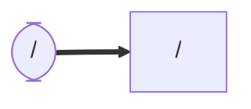

# lucia_audio_generator
### Node and Topic

## Dependency

## Setup
```
$ cd ~/ros2_ws/src  #Go to ros workspace
$ git clone https://github.com/iHaruruki/lucia_audio_generatior.git #clone this package
$ cd ~/ros2_ws
$ colcon build --symlink-install
$ source install/setup.bash
```

## Usage
```
$ ros2 run audio_generator_node
```
### Send Topic message
```
$ ros2 topic pub /tts_text std_msgs/String "data: 'こんにちは、世界！'" --once
```
## License
## Authors

## References
